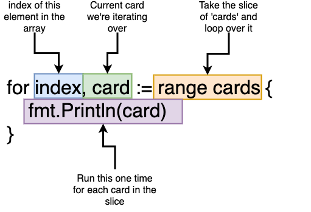

### How do we run the code in our project?

`go run main.go`


##### Go CLI

- `go build`: compiles a bunch of go source code files -> just to compile a program
- `go run`: compiles and executes one or two files -> compile and imediately execute a program
- `go fmt`: formats all the code in each file in the current directory
- `go install`: compiles and "installs" a package
- `go get`: downloads the raw source code of someone else's package
- `go test`: runs any tests associated with the current project

### What does 'package main' mean?

`Package` == `Project` == `Workspace`

**Package:** is a collection of common source files. Every go file must have the package they belong to at the beginning of the file.
- Types of packages:
	- Executable: generates a file that we can run
	- Reusable/dependency: code used as 'helpers'. Good place to put reusable logic

The name of the `package main` will be a executable file. Any other package name, will create resusable file logic.

Executable packages MUST have a function called `main` inside it:

```go
package main

import "fmt"

func main() {
	fmt.Println("Hi there!")
}

```

### What does 'import "fmt"' mean?

`fmt` is a standard library. Is the short version for the word `format` (quite obvious lol)

Standard packages docs: https://golang.org/pkg/


### How is the main.go file organized?

Package declaration -> imports -> functions

### Basic/Fundamental Go Types

`bool` -> `true` or `false`
`string`-> `"Hi!"`, `"Hows it going?"`
`int` -> `0`, `-10000`, `99999`
`float64` -> `10.000001`, `0.00009`, `-100.003`

##### New variables
```go
func main() {
    //These both lines are equivalent
    // var card string = "Ace of Spades"
    card := "Ace of Spades"

    fmt.Println(card)
}

```

`:=` -> go compiler figures out that the card is a string, so no need to explicitly declare it is a string type

Note: we only use `:=` when declaring a new variable. It won't work if we're trying to assign a new value to it. Example on how we should do it:

```go
func main() {
    card := "Ace of Spades"
    card = "Five of Diamonds"

    fmt.Println(card)
}

```


#### Lists/Arrays
type `Array` is always going to be fixed length list of things
type `Slice` is an array that can grow or shrink

```go
package main

import "fmt"

func main() {
	cards := []string{"Ace of Diamonds", newCard()}
	cards = append(cards, "Six of Spades") //append creates a new slice

	for i, card := range cards {
		fmt.Println(i, card)
	}
}

func newCard() string {
	return "Five of Diamonds"
}
```

<div align="center">
    
</div>

#### Testing with Go

Go testing is not RSpec, mocha, jasmine, selenuim, etc!

To make a teste, create a new file ending in `_test.go`, such as `deck_test.go`.
To run all tests in a package, run the command `go test`